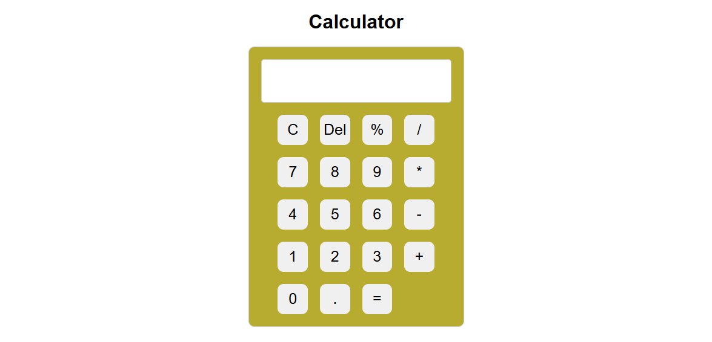

# Custom Vanilla JS Calculator 🧮



A fully functional, responsive web-based calculator built entirely with HTML, CSS, and Vanilla JavaScript. 

While many beginner calculator projects rely on JavaScript's built-in `eval()` function, this project takes an algorithmic approach by implementing a **custom mathematical expression parser**. This ensures a deeper understanding of string manipulation, array operations (like tokenization and splicing), and secure coding practices.

## ✨ Features

* **Custom Evaluation Engine:** Parses complex mathematical expressions sequentially, strictly respecting the mathematical order of operations.
* **Two-Pass Parsing Algorithm:** 
  * **Tokenization:** Splits the raw input string into numbers and operators, safely handling negative numbers at the start of an expression.
  * **Pass 1:** Resolves high-priority operations (Multiplication `*`, Division `/`, Modulo `%`).
  * **Pass 2:** Resolves low-priority operations (Addition `+`, Subtraction `-`).
* **Robust Edge Case Handling:**
  * Prevents the input of consecutive operators (e.g., typing `5 + * 3` is blocked).
  * Safely handles and prevents division by zero bugs.
* **Modern UI:** Built with CSS Flexbox and Grid for a clean, perfectly aligned interface with interactive hover scaling effects.

## 🛠️ Technologies Used

* **HTML5:** Semantic structure.
* **CSS3:** Custom styling, Grid layout for the keypad, and Flexbox for centering.
* **Vanilla JavaScript (ES6+):** DOM manipulation, event listeners, and the core algorithmic parsing logic.

## 🚀 How to Run

1. Clone the repository:
   ```bash
   git clone [https://github.com/FILIPPOSVEZYRIS/Calculator.git](https://github.com/FILIPPOSVEZYRIS/Calculator.git)

2. Open index.html in your favorite web browser. No local server or extra dependencies required!